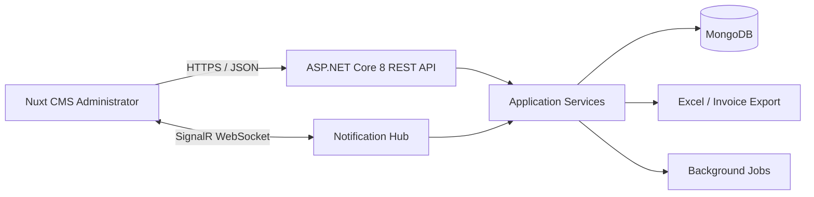

# MotoCare - Mô tả kỹ thuật và phạm vi tính năng

**Phiên bản:** 1.0  
**Ngày lập:** 27/07/2026  
**Phạm vi:** MVP hệ thống quản lý tiệm sửa chữa và nâng cấp xe máy  

## 1. Mục tiêu

MotoCare là hệ thống quản trị tập trung cho tiệm sửa chữa, bảo dưỡng và nâng cấp xe máy. Hệ thống giúp lưu hồ sơ khách hàng và phương tiện, theo dõi toàn bộ vòng đời phiếu sửa chữa, quản lý nhân sự thực hiện, phụ tùng, hóa đơn, dòng tiền và báo cáo kinh doanh.

Các mục tiêu chính:

- Giảm thất lạc thông tin tiếp nhận và lịch sử sửa chữa.
- Theo dõi rõ tình trạng xe, người thực hiện, vật tư và chi phí.
- Kiểm soát tồn kho và cảnh báo phụ tùng sắp hết.
- Chuẩn hóa hóa đơn, thu chi và báo cáo quản trị.
- Cập nhật trạng thái, cảnh báo theo thời gian thực cho người dùng CMS.

## 2. Phạm vi người dùng và phân quyền

| Vai trò | Quyền chính |
|---|---|
| Quản trị viên | Toàn quyền cấu hình, tài khoản, danh mục, dữ liệu và báo cáo |
| Quản lý | Quản lý khách hàng, xe, phiếu sửa chữa, kho, hóa đơn, thu chi và báo cáo |
| Tiếp nhận | Tạo/cập nhật khách hàng, xe, phiếu tiếp nhận; xem tiến độ; lập hóa đơn |
| Kỹ thuật viên | Xem việc được giao, cập nhật chẩn đoán, hạng mục, phụ tùng và trạng thái |
| Thu ngân/Kế toán nội bộ | Thanh toán hóa đơn, ghi nhận thu chi, xem báo cáo được phân quyền |

Hệ thống dùng RBAC. Mỗi tài khoản có thể được gán một hoặc nhiều vai trò; API kiểm tra quyền ở phía máy chủ, không chỉ ẩn chức năng trên giao diện.

## 3. Kiến trúc đề xuất



### 3.1 Backend

- ASP.NET Core 8 Web API, kiến trúc phân lớp theo hướng Clean Architecture.
- MongoDB Driver for .NET; dữ liệu được tổ chức theo collection và document, không sử dụng Entity Framework Core.
- MongoDB chạy ở chế độ replica set để hỗ trợ transaction nhiều document cho các nghiệp vụ kho, thanh toán và loyalty.
- RESTful API, OpenAPI/Swagger, validation đầu vào, xử lý lỗi thống nhất.
- Xác thực JWT access token; tài khoản lưu trong collection riêng và mật khẩu được băm bằng `PasswordHasher<TUser>` của ASP.NET Core.
- SignalR cho thông báo realtime.
- ClosedXML hoặc thư viện tương đương để xuất Excel.
- Logging có cấu trúc; lưu nhật ký thao tác quan trọng.

### 3.2 Frontend

- Nuxt v4 và TypeScript.
- CMS responsive cho desktop và tablet.
- Quản lý trạng thái đăng nhập, phân quyền màn hình và quyền thao tác.
- Bảng dữ liệu có tìm kiếm, lọc, phân trang, sắp xếp; biểu mẫu có validation.
- Trang dashboard, thông báo realtime và trạng thái chưa đọc.

### 3.3 Quy ước chung

- Thời gian lưu theo UTC trong cơ sở dữ liệu và hiển thị theo múi giờ Việt Nam.
- Tiền tệ lưu bằng `Decimal128`, đơn vị VND, không dùng số thực dấu phẩy động.
- Dữ liệu nghiệp vụ quan trọng ưu tiên xóa mềm để bảo toàn lịch sử.
- Mã chứng từ sinh tự động và duy nhất, ví dụ `RO-202607-0001`, `INV-202607-0001`.
- Mỗi document có `SchemaVersion` để hỗ trợ thay đổi cấu trúc dữ liệu và chạy migration script khi nâng cấp.
- Các khóa nghiệp vụ như mã chứng từ, số điện thoại chuẩn hóa, biển số, SKU và mã giao dịch loyalty có unique index phù hợp.

## 4. Mô hình dữ liệu chính

### 4.1 Khách hàng (`Customer`)

| Trường | Ý nghĩa |
|---|---|
| Id | Khóa định danh |
| Code | Mã khách hàng tự động |
| FullName | Họ và tên |
| Phone | Số điện thoại, dùng để tìm kiếm/kiểm tra trùng |
| Email | Email |
| Address | Địa chỉ |
| DateOfBirth | Ngày sinh, không bắt buộc |
| Gender | Giới tính, không bắt buộc |
| TaxCode | Mã số thuế, nếu xuất hóa đơn cho tổ chức/cá nhân kinh doanh |
| Notes | Ghi chú, sở thích, lưu ý chăm sóc |
| LoyaltyAccountId | Liên kết tài khoản loyalty của khách hàng |
| LoyaltyTierCode | Hạng thành viên hiện tại, lưu tóm tắt để tra cứu nhanh |
| LoyaltyPointBalance | Số điểm khả dụng hiện tại, là dữ liệu tổng hợp từ sổ giao dịch điểm |
| CreatedAt/UpdatedAt | Thời điểm tạo/cập nhật |
| IsActive/DeletedAt | Trạng thái và xóa mềm |

Lịch sử sửa chữa của khách hàng được tổng hợp từ các xe và phiếu sửa chữa, không nhập lặp thủ công.

### 4.2 Hệ thống khách hàng thân thiết (`Loyalty`)

**LoyaltyTier:**

- Code, Name, Rank, Description, IsActive.
- MinEligibleSpend hoặc MinEarnedPoints để xác định hạng.
- EarnRate: số điểm nhận trên mỗi đơn vị chi tiêu đủ điều kiện.
- RedemptionValue: giá trị VND tương ứng với một điểm khi đổi.
- Benefits: mô tả quyền lợi, ưu đãi hoặc mức giảm giá của hạng.

**LoyaltyAccount:**

- CustomerId, MemberCode, CurrentTierCode.
- AvailablePoints, PendingPoints, LifetimeEarnedPoints, LifetimeRedeemedPoints.
- EligibleSpend, JoinedAt, TierUpdatedAt, Status.

**LoyaltyTransaction:**

- TransactionCode duy nhất và `IdempotencyKey` để chống ghi nhận trùng.
- LoyaltyAccountId, CustomerId, InvoiceId/PaymentId.
- Type: `Earn`, `Redeem`, `Expire`, `Adjust`, `Reverse`.
- Points, MonetaryValue, BalanceBefore, BalanceAfter.
- EarnedAt, EffectiveAt, ExpiresAt, CreatedBy, Reason, ReferenceTransactionId.

**LoyaltyRule:**

- Tỷ lệ tích điểm, giá trị quy đổi, thời hạn điểm và số điểm tối thiểu khi đổi.
- Tỷ lệ tối đa được thanh toán bằng điểm trên một hóa đơn.
- Điều kiện áp dụng theo hạng thành viên, loại dịch vụ, phụ tùng hoặc thời gian chương trình.
- Ngày hiệu lực, ngày kết thúc và trạng thái.

`LoyaltyTransaction` là sổ cái điểm và không được sửa/xóa sau khi ghi nhận. Sai sót được xử lý bằng giao dịch `Reverse` hoặc `Adjust`. Số dư trên `LoyaltyAccount` và `Customer` là dữ liệu tổng hợp để đọc nhanh, được cập nhật trong cùng transaction MongoDB.

### 4.3 Nhân viên (`Employee`) và tài khoản (`User`)

| Trường | Ý nghĩa |
|---|---|
| EmployeeCode | Mã nhân viên |
| FullName | Họ và tên |
| Phone/Email/Address | Thông tin liên hệ |
| DateOfBirth | Ngày sinh |
| HireDate | Ngày vào làm |
| Position | Chức danh |
| SkillLevel/Specialties | Bậc nghề và chuyên môn |
| BaseSalary | Lương cơ bản, chỉ hiển thị với quyền phù hợp |
| Status | Đang làm, tạm nghỉ, đã nghỉ |
| UserId | Liên kết tài khoản đăng nhập |
| Notes | Ghi chú nội bộ |

Lịch sử công việc của nhân viên được tổng hợp từ các hạng mục trong phiếu sửa chữa mà nhân viên được phân công.

### 4.4 Hãng xe, dòng xe và xe khách hàng

**VehicleBrand:** Code, Name, Country, IsActive.  
**VehicleModel:** BrandId, Code, Name, VehicleType, EngineCapacity, IsActive.  
**Vehicle:** CustomerId, VehicleModelId, LicensePlate, VIN/FrameNumber, EngineNumber, ManufactureYear, Color, Odometer, PurchaseDate, Notes.

Ràng buộc đề xuất:

- Biển số được chuẩn hóa trước khi tìm kiếm và không trùng giữa các xe đang hoạt động.
- Dòng xe bắt buộc thuộc một hãng xe.
- Số khung và số máy được kiểm tra trùng nếu có dữ liệu.

### 4.5 Hãng phụ tùng, phụ tùng và tồn kho

**PartBrand:** Code, Name, Country, ContactInfo, IsActive.

**Part:**

- Code/SKU, Barcode, Name, PartBrandId, Unit.
- ImportPrice: giá nhập gần nhất hoặc giá nhập chuẩn.
- StockPrice: giá vốn kho theo phương pháp được thống nhất.
- SalePrice: giá bán đề xuất; bổ sung để lập hóa đơn chính xác.
- QuantityOnHand, MinQuantity, Location.
- IsActive, Notes, CreatedAt, UpdatedAt.

**InventoryTransaction:** PartId, Type, Quantity, UnitCost, ReferenceType, ReferenceId, TransactionDate, PerformedBy, Notes.

Tồn kho được tính từ giao dịch nhập, xuất, điều chỉnh và hoàn trả. Khi `QuantityOnHand < MinQuantity`, hệ thống tạo cảnh báo và đẩy notification realtime cho vai trò được cấu hình.

### 4.6 Phiếu sửa chữa

**RepairOrder:**

- Code, CustomerId, VehicleId.
- ReceivedAt, ExpectedDeliveryAt, DeliveredAt.
- OdometerIn, FuelLevel, VehicleCondition, CustomerRequest.
- Diagnosis, InternalNotes, WarrantyNotes.
- Priority: thấp, bình thường, cao, khẩn.
- Status: mới tiếp nhận, chờ kiểm tra, chờ duyệt báo giá, đang sửa, chờ phụ tùng, hoàn tất, đã giao, hủy.
- EstimatedTotal, DiscountAmount, FinalTotal.
- CreatedBy, ServiceAdvisorId.

**RepairOrderItem:**

- RepairOrderId, ItemType (`Service` hoặc `Part`).
- ServiceId/PartId, Description, Quantity, UnitPrice, DiscountAmount, LineTotal.
- AssignedEmployeeId, WorkStatus, StartedAt, CompletedAt, TechnicianNotes.

**RepairStatusHistory:** RepairOrderId, FromStatus, ToStatus, ChangedBy, ChangedAt, Note.

Một phiếu có thể giao nhiều nhân viên theo từng hạng mục. Khi xuất phụ tùng cho phiếu, hệ thống ghi giao dịch kho có tham chiếu đến phiếu sửa chữa.

### 4.7 Hóa đơn và thanh toán

**Invoice:**

- Code, RepairOrderId, CustomerId, IssueDate.
- Subtotal, DiscountAmount, TaxRate, TaxAmount, TotalAmount.
- PaidAmount, RemainingAmount.
- PaymentStatus: chưa thanh toán, thanh toán một phần, đã thanh toán, hoàn tiền/hủy.
- CustomerName, Phone, Address, TaxCode tại thời điểm xuất.
- CreatedBy, Notes.

**InvoiceItem:** InvoiceId, ItemType, ReferenceId, Description, Quantity, UnitPrice, DiscountAmount, TaxRate, LineTotal.

**Payment:** InvoiceId, Amount, Method, PaidAt, ReferenceCode, ReceivedBy, Notes.

Hóa đơn hỗ trợ bản in A4 qua trình duyệt và xuất PDF. Mẫu in gồm thông tin cửa hàng, khách hàng, xe, chi tiết dịch vụ/phụ tùng, giảm giá, thuế, tổng tiền, đã trả, còn lại và chữ ký.

Khi hóa đơn đạt điều kiện tích điểm, hệ thống tạo giao dịch `Earn`. Khi dùng điểm, hóa đơn lưu thêm `LoyaltyPointsRedeemed` và `LoyaltyDiscountAmount`. Hủy, hoàn tiền hoặc giảm giá sau thanh toán phải tạo giao dịch đảo điểm tương ứng.

### 4.8 Thu chi

**CashTransaction:**

- Code, Type (`Income`/`Expense`).
- CategoryId, TransactionDate, Amount, PaymentMethod.
- ReferenceType/ReferenceId để liên kết hóa đơn, nhập kho hoặc nghiệp vụ khác.
- Description, AttachmentUrl, CreatedBy, ApprovedBy, Status.

Doanh thu được tính từ hóa đơn hợp lệ; dòng tiền được tính từ các khoản thực thu/thực chi. Hai khái niệm này được hiển thị tách biệt để tránh sai lệch báo cáo.

### 4.9 Thông báo và nhật ký

**Notification:** UserId/RoleId, Type, Title, Message, ReferenceType, ReferenceId, IsRead, CreatedAt, ReadAt.  
**AuditLog:** UserId, Action, EntityType, EntityId, BeforeData, AfterData, IpAddress, CreatedAt.

## 5. Chức năng chi tiết

### 5.1 Dashboard

- Tổng số xe đang tiếp nhận, đang sửa, chờ phụ tùng và chờ giao.
- Doanh thu hôm nay/tháng này; tổng công nợ chưa thu.
- Danh sách phụ tùng dưới mức tồn tối thiểu.
- Phiếu trễ ngày giao dự kiến và công việc mới được phân công.
- Số thành viên loyalty theo hạng, điểm đã phát hành/đã đổi và điểm sắp hết hạn.

### 5.2 Quản lý khách hàng

- Thêm, xem, sửa, khóa/xóa mềm và khôi phục.
- Tìm theo mã, tên, số điện thoại, biển số.
- Xem danh sách xe, lịch sử sửa chữa, hóa đơn và tổng chi tiêu.
- Xem mã thành viên, hạng, số dư điểm, tổng điểm đã tích/đã đổi và lịch sử giao dịch điểm.
- Tự động đánh giá khách hàng thân thiết theo tổng chi tiêu đủ điều kiện hoặc tổng điểm tích lũy.
- Cho phép quản trị viên điều chỉnh điểm có lý do; mọi điều chỉnh được ghi sổ và audit log.

### 5.3 Loyalty khách hàng thân thiết

- Cấu hình các hạng thành viên, ngưỡng lên hạng, tỷ lệ tích điểm và giá trị quy đổi.
- Tự động tạo tài khoản loyalty khi khách hàng phát sinh hóa đơn hợp lệ hoặc khi nhân viên kích hoạt thủ công.
- Tích điểm khi hóa đơn được thanh toán đủ; số điểm được tính trên giá trị đủ điều kiện sau giảm giá và không tính phần đã thanh toán bằng điểm.
- Đổi điểm trực tiếp khi thanh toán hóa đơn, kiểm tra số dư và giới hạn đổi trước khi xác nhận.
- Tự động nâng/hạ hạng theo chính sách và lưu lịch sử thay đổi hạng.
- Hỗ trợ điểm hết hạn nếu chính sách có cấu hình; job nền xử lý hết hạn và gửi cảnh báo trước hạn.
- Hủy/hoàn tiền hóa đơn sẽ đảo số điểm đã tích hoặc hoàn lại điểm đã dùng theo đúng giao dịch gốc.
- Tra cứu sổ điểm theo khách hàng, hóa đơn, loại giao dịch và khoảng thời gian.

### 5.4 Quản lý nhân viên

- CRUD hồ sơ nhân viên và trạng thái làm việc.
- Tạo/liên kết tài khoản, phân vai trò.
- Xem lịch sử hạng mục sửa chữa, số việc hoàn thành và giá trị công việc.
- Không cho xóa cứng nhân viên đã phát sinh dữ liệu lịch sử.

### 5.5 Quản lý xe và danh mục xe

- CRUD hãng xe, dòng xe theo hãng và xe của khách hàng.
- Kiểm tra trùng biển số, số khung, số máy.
- Xem lịch sử tiếp nhận, số km và hạng mục đã thực hiện.

### 5.6 Tiếp nhận và sửa chữa

Luồng chuẩn:

1. Chọn hoặc tạo khách hàng và xe.
2. Ghi nhận yêu cầu, tình trạng xe, số km, ngày nhận và ngày giao dự kiến.
3. Chẩn đoán; thêm dịch vụ/phụ tùng và lập dự toán.
4. Gán kỹ thuật viên theo hạng mục.
5. Cập nhật tiến độ; ghi nhận phụ tùng xuất kho.
6. Hoàn tất kiểm tra, xác nhận chi phí cuối.
7. Lập hóa đơn, nhận thanh toán và bàn giao xe.

Mọi thay đổi trạng thái đều ghi lịch sử người thao tác và thời điểm. Phiếu đã xuất hóa đơn không được sửa tùy ý; thao tác điều chỉnh phải có quyền và nhật ký.

### 5.7 Quản lý phụ tùng

- CRUD hãng phụ tùng, phụ tùng, giá và vị trí kho.
- Nhập kho, xuất cho phiếu sửa chữa, điều chỉnh và xem thẻ kho.
- Cảnh báo tồn dưới `MinQuantity`.
- Báo cáo bán/xuất theo số lượng và doanh thu.

### 5.8 Hóa đơn

- Lập từ phiếu sửa chữa, tự lấy các dòng dịch vụ và phụ tùng.
- Cho phép giảm giá theo dòng hoặc toàn hóa đơn theo quyền.
- Ghi nhận nhiều lần thanh toán và nhiều phương thức.
- Hiển thị điểm dự kiến nhận, số điểm có thể đổi và giá trị giảm trừ từ điểm trước khi thanh toán.
- Ghi nhận tích/đổi/đảo điểm đồng bộ với trạng thái thanh toán, hủy và hoàn tiền.
- In A4/xuất PDF; tra cứu theo mã, khách hàng, biển số, ngày và trạng thái.
- MVP không bao gồm phát hành hóa đơn điện tử có ký số với cơ quan thuế.

### 5.9 Thu chi và doanh thu

- Danh mục khoản thu/chi.
- Ghi nhận, duyệt/hủy giao dịch theo quyền.
- Sổ quỹ theo ngày và phương thức thanh toán.
- Tổng hợp doanh thu, giảm giá, tiền đã thu, công nợ và chi phí.

### 5.10 Báo cáo và Excel

| Báo cáo | Chỉ số chính | Bộ lọc |
|---|---|---|
| Xe sửa nhiều nhất | Số lần sửa, tổng chi tiêu theo xe/dòng xe | Khoảng ngày, hãng, dòng xe |
| Khách hàng thân thiết | Hạng, số phiếu, chi tiêu đủ điều kiện, điểm đã tích/đã đổi, số dư và lần gần nhất | Khoảng ngày, hạng, ngưỡng chi tiêu |
| Giao dịch loyalty | Điểm tích, đổi, hết hạn, điều chỉnh và đảo điểm | Khoảng ngày, hạng, loại giao dịch |
| Phụ tùng bán chạy | Số lượng, doanh thu, lợi nhuận ước tính | Khoảng ngày, hãng phụ tùng |
| Doanh thu | Doanh thu, giảm giá, đã thu, công nợ | Tuần, tháng, quý, khoảng ngày |
| Tồn kho thấp | Tồn hiện tại, mức tối thiểu, lượng cần nhập | Hãng, trạng thái |
| Hiệu suất nhân viên | Hạng mục hoàn tất, giá trị công việc | Khoảng ngày, nhân viên |

Các báo cáo dạng bảng hỗ trợ xuất `.xlsx`, giữ nguyên bộ lọc và có dòng tổng cộng.

## 6. Notification realtime

SignalR gửi thông báo trong các trường hợp:

- Kỹ thuật viên được giao hoặc thay đổi công việc.
- Phiếu sửa chữa thay đổi trạng thái.
- Phiếu sắp trễ hoặc đã trễ ngày giao dự kiến.
- Phụ tùng xuống dưới mức tồn tối thiểu.
- Hóa đơn được thanh toán hoặc còn công nợ.
- Khách hàng được nâng hạng, nhận điểm, dùng điểm hoặc có điểm sắp hết hạn.

Thông báo được lưu trong cơ sở dữ liệu để người dùng xem lại, đánh dấu đã đọc; realtime chỉ là kênh truyền tức thời. Nếu kết nối bị gián đoạn, danh sách thông báo vẫn được đồng bộ khi tải lại.

## 7. API dự kiến

API dùng tiền tố `/api/v1`. Các nhóm endpoint chính:

```text
POST   /auth/login
GET    /customers
POST   /customers
GET    /customers/{id}/repair-history
GET    /customers/{id}/loyalty
GET    /loyalty/tiers
POST   /loyalty/tiers
GET    /loyalty/rules
POST   /loyalty/rules
GET    /loyalty/accounts/{customerId}/transactions
POST   /loyalty/accounts/{customerId}/adjustments
POST   /loyalty/redemptions/preview
GET    /employees/{id}/work-history
GET    /vehicle-brands
GET    /vehicle-models?brandId={id}
GET    /vehicles?customerId={id}
POST   /repair-orders
PATCH  /repair-orders/{id}/status
POST   /repair-orders/{id}/items
POST   /repair-orders/{id}/assignments
GET    /parts?lowStock=true
POST   /inventory/receipts
POST   /inventory/adjustments
POST   /invoices/from-repair-order/{repairOrderId}
POST   /invoices/{id}/payments
GET    /reports/revenue
GET    /reports/top-vehicles
GET    /reports/loyal-customers
GET    /reports/loyalty-transactions
GET    /reports/top-parts
GET    /reports/{reportName}/export
GET    /notifications
PATCH  /notifications/{id}/read
```

Danh sách trả về có phân trang và metadata tổng số bản ghi. Các lệnh tạo/cập nhật trả lỗi validation rõ theo từng trường.

## 8. Yêu cầu phi chức năng

- Bảo mật: HTTPS, JWT, RBAC, validation, chống truy cập chéo dữ liệu, không ghi mật khẩu/token vào log.
- Hiệu năng MVP: trang danh sách phổ biến phản hồi mục tiêu dưới 2 giây với quy mô khoảng 100.000 document khi có compound index và projection phù hợp.
- Toàn vẹn dữ liệu: MongoDB transaction cho xuất kho, hoàn tất phiếu, lập hóa đơn, thanh toán và cập nhật sổ điểm; môi trường chạy bắt buộc hỗ trợ replica set.
- Đồng thời: dùng optimistic concurrency hoặc điều kiện cập nhật nguyên tử để tránh âm tồn kho, tiêu điểm vượt số dư và ghi nhận thanh toán trùng.
- Sao lưu: hướng dẫn `mongodump`/`mongorestore` hoặc snapshot/backup của MongoDB Atlas; lịch backup thực tế do hạ tầng triển khai cấu hình.
- Khả dụng: giao diện responsive, trạng thái loading/error/empty rõ ràng.
- Quan sát: log lỗi phía API, correlation ID và thông tin người thao tác.
- Ngôn ngữ: giao diện tiếng Việt; cấu trúc sẵn sàng bổ sung đa ngôn ngữ nhưng không nằm trong MVP.

## 9. Kế hoạch triển khai 03 tuần

| Tuần | Công việc | Kết quả |
|---|---|---|
| Tuần 1 | Chốt nghiệp vụ, thiết kế MongoDB, nền tảng API/CMS, đăng nhập-phân quyền, khách hàng, nhân viên, hãng/dòng xe, xe | Bản chạy nội bộ cho dữ liệu nền |
| Tuần 2 | Phiếu sửa chữa, phân công, phụ tùng, kho, loyalty, cảnh báo và SignalR | Hoàn thành luồng tiếp nhận, sửa chữa và tích/đổi điểm |
| Tuần 3 | Hóa đơn/in, thanh toán, thu chi, dashboard, báo cáo, Excel, kiểm thử, sửa lỗi và bàn giao | Bản MVP nghiệm thu và tài liệu vận hành |

Thời gian được tính từ khi nhận đủ tạm ứng, thông tin cửa hàng và xác nhận phạm vi. Phản hồi/chờ duyệt từ khách hàng có thể làm dịch chuyển lịch bàn giao tương ứng.

## 10. Tiêu chí nghiệm thu

- Đăng nhập, phân quyền đúng theo vai trò.
- CRUD hoạt động cho khách hàng, nhân viên, hãng/dòng xe, xe, hãng phụ tùng và phụ tùng.
- Tạo được phiếu sửa chữa, phân công nhân viên, cập nhật đầy đủ trạng thái và lịch sử.
- Xuất/hoàn phụ tùng làm thay đổi tồn kho đúng và tạo cảnh báo dưới mức tối thiểu.
- Lập hóa đơn từ phiếu, ghi nhận thanh toán, in/xuất PDF được.
- Tích điểm khi thanh toán đủ, đổi điểm đúng số dư và tự động đảo điểm khi hủy/hoàn tiền.
- Cấu hình được hạng thành viên, ngưỡng hạng, tỷ lệ tích điểm, giá trị quy đổi và thời hạn điểm.
- Sổ giao dịch điểm truy vết được nguồn phát sinh; không tạo giao dịch trùng khi API được gửi lại.
- Ghi nhận thu chi và hiển thị doanh thu theo tuần, tháng, quý.
- Báo cáo nghiệp vụ và loyalty chạy đúng bộ lọc và xuất Excel được.
- Notification realtime hoạt động cho phân công, trạng thái phiếu và tồn kho thấp.
- Không có lỗi nghiêm trọng làm gián đoạn luồng nghiệp vụ chính tại thời điểm nghiệm thu.

## 11. Phạm vi bàn giao

- Mã nguồn Backend ASP.NET Core 8 và Frontend Nuxt.
- Script tạo collection/index, migration theo `SchemaVersion` và dữ liệu danh mục mẫu cho MongoDB.
- File cấu hình mẫu, hướng dẫn chạy/deploy và tài liệu API Swagger.
- Tài khoản quản trị ban đầu.
- Hướng dẫn sử dụng ngắn cho các luồng chính.
- Bảo hành sửa lỗi thuộc phạm vi đã thống nhất trong 30 ngày sau nghiệm thu.

## 12. Ngoài phạm vi MVP

- Ứng dụng mobile native, cổng tự phục vụ riêng cho khách hàng.
- Tích hợp hóa đơn điện tử có ký số/cơ quan thuế, ngân hàng, cổng thanh toán hoặc SMS trả phí.
- Tích hợp máy chấm công, máy quét chuyên dụng, máy in tem hoặc phần cứng khác.
- Kế toán tài chính đầy đủ, tính lương/hoa hồng chuyên sâu, nhiều chi nhánh/kho phức tạp.
- Nhập dữ liệu lịch sử số lượng lớn, làm sạch dữ liệu cũ.
- Phí tên miền, máy chủ, SSL trả phí, dịch vụ email/SMS và bản quyền bên thứ ba.

Các hạng mục ngoài phạm vi sẽ được khảo sát và báo giá bổ sung trước khi thực hiện.

## 13. Giả định và điểm cần chốt khi khởi động

- Một cửa hàng, một kho chính, một đơn vị tiền tệ VND.
- Khách hàng cung cấp tên, địa chỉ, số điện thoại, logo và thông tin in hóa đơn.
- Chốt MongoDB tự quản trị hoặc MongoDB Atlas, cấu hình replica set, môi trường triển khai và mẫu số/mã chứng từ.
- Chốt cách tính giá vốn kho, chính sách thuế/giảm giá, quy trình duyệt báo giá sửa chữa.
- Chốt tỷ lệ tích điểm, giá trị quy đổi, ngưỡng từng hạng, thời hạn điểm, giới hạn đổi điểm và quy tắc xử lý hoàn tiền.
- Chốt mẫu in A4 và danh sách vai trò/quyền thực tế.
- Dữ liệu mẫu được khách hàng duyệt trong tuần đầu.

## 14. Định hướng mở rộng

Sau MVP có thể mở rộng đa chi nhánh, đặt lịch online, nhắc bảo dưỡng tự động, quản lý bảo hành, hoa hồng kỹ thuật viên, chiến dịch nhân hệ số điểm/coupon, nhập hàng/nhà cung cấp, ứng dụng khách hàng, hóa đơn điện tử và dashboard phân tích nâng cao.
